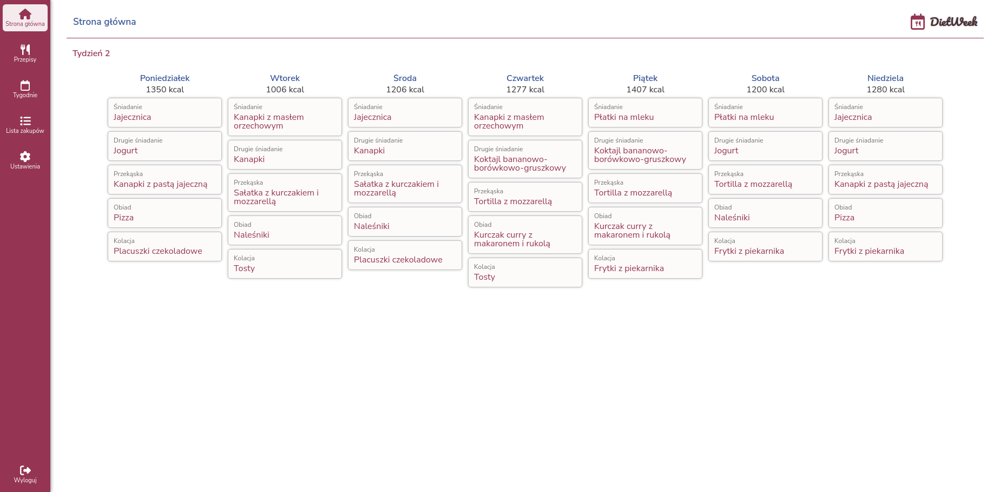
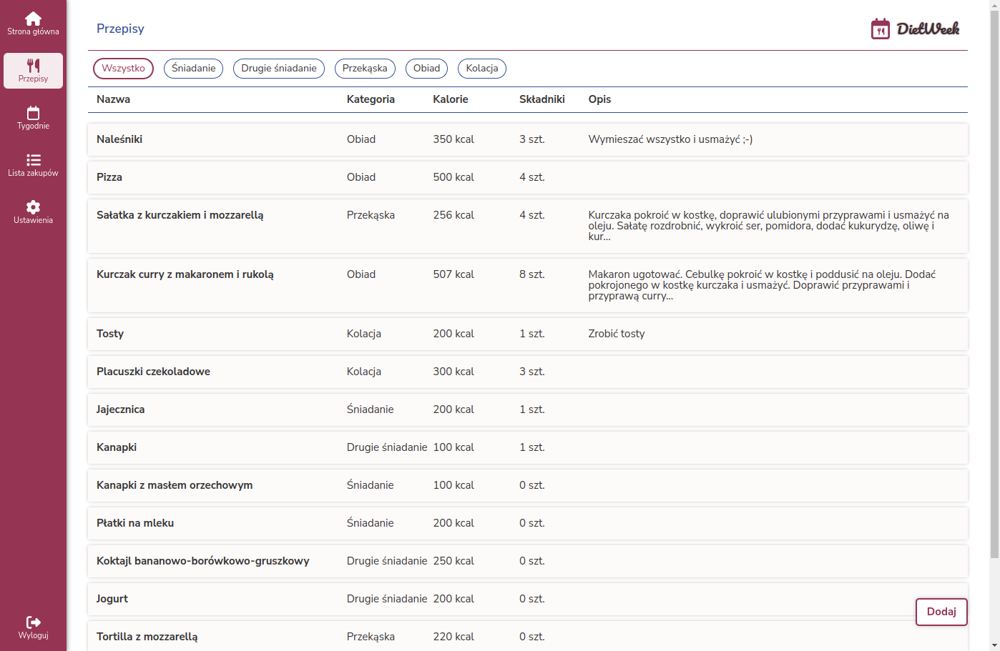

# DietWeek

Aplikacja pomagająca w planowaniu diety oraz zarządzaniu posiadanymi przepisami. Po utworzeniu konta, używkownik ma możliwość dodawania i edycji przepisów oraz tygodni ułożonych na ich podstawie. Stworzenie tygodnia, generuje listę zakupów produktów potrzebnych w danym tygodniu wraz z łatwym dostępem do niej.

An application to help you plan your diet and manage your recipes. After creating an account, the user has the ability to add and edit recipes and weeks arranged based on them. Creating a week, generates a shopping list of products needed for the week along with easy access to it as well as recipes.

## Demo

https://piotrhol.github.io/DietWeek/

## Technologies

React, Sass, React Router, Firebase, Redux, classnames, dotenv, React Hook Form, React Slick, Font Awesome, PWA

## Example screenshots

- Login page

- Home page

- Recipe view

- Recipes page

- Shopping list page

